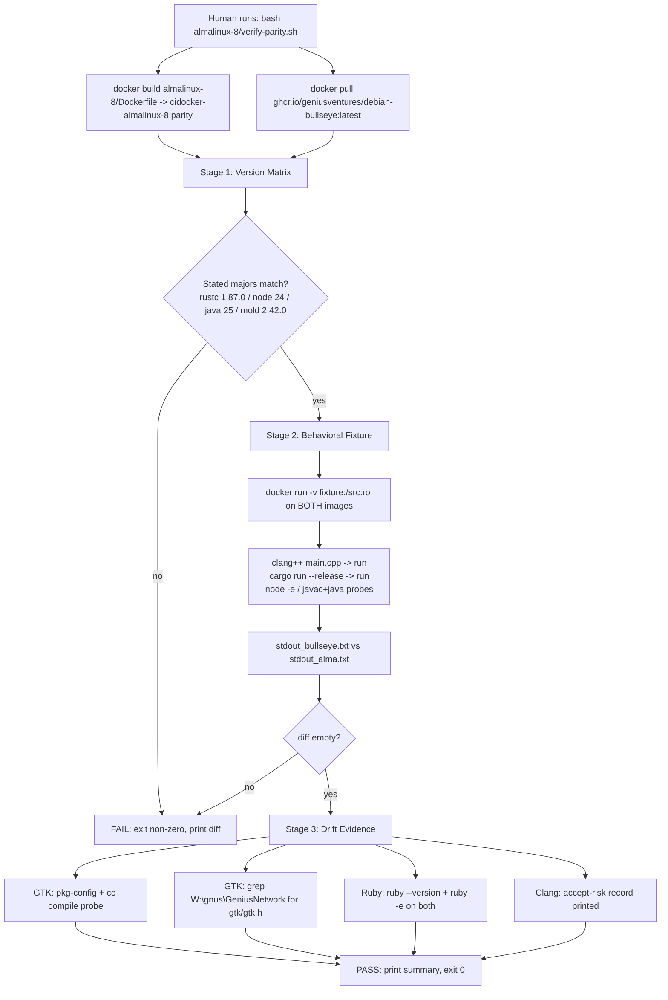

# Phase 3: Parity & Verification - Research

**Researched:** 2026-09-09
**Domain:** Docker image behavioral-parity verification — a versioned bash harness that runs `debian-bullseye` and `almalinux-8` side-by-side and compares toolchain versions, a minimal build fixture, and the GTK/clang/Ruby drift checks.
**Confidence:** HIGH — the toolchain pins and verification probes are read directly from the two Dockerfiles this session; the GTK gap was characterized live against the consuming monorepo; Docker availability was probed live. MEDIUM only on the exact bullseye drift patch levels (clang 11.x / ruby 2.7.x / gtk 3.24.x), which are carried from project docs, not re-fetched.

## Summary

Phase 3 produces **verification evidence, not image layers**. The deliverable is a single versioned repo script — `almalinux-8/verify-parity.sh` (locked decision D-01) — plus a minimal in-repo build fixture, run **manually** for this phase's sign-off. The script pulls the frozen `debian-bullseye` image from ghcr and builds the `almalinux-8` image locally, then (1) prints and compares the toolchain version matrix at the stated-major level (Rust 1.87.0, Node 24.x, JDK 25.x, mold 2.42.0 — D-03), (2) builds + runs a minimal C++ (clang + mold) and Rust fixture on **both** images and diffs the behavioral output (D-05/D-06), and (3) emits the GTK / clang / Ruby drift evidence.

The two requirements map cleanly: **PAR-01** (toolchain version parity) is satisfied by the side-by-side version matrix + the fixture that exercises clang, mold, Rust, and (optionally) Node/Java; **PAR-02** (GTK gap non-blocking) is satisfied by (a) a compile probe against EL8 `gtk3-devel` and (b) a grep of the consuming monorepo for GTK includes. The grep was run live this session and is conclusive: **GTK headers appear only in `GeniusWallet` Flutter scaffolding** (`my_application.h` + `.plugin_symlinks` ephemeral files) — the core C++/Rust projects (`SuperGenius`, `GeniusSDK`, `util`, `zkLLVM`, `TokenContracts`, `TestVMs`) have **zero** GTK includes, and Flutter is explicitly out of scope (D-05).

**Primary recommendation:** Write one bash script at `almalinux-8/verify-parity.sh` (with a colocated `fixture/` directory) that builds the Alma image locally, pulls `ghcr.io/geniusventures/debian-bullseye:latest`, and runs three ordered stages — *version matrix* (fail on stated-major mismatch), *behavioral fixture* (fail if `diff` of both images' stdout is non-empty), *drift probes* (GTK compile + grep, Ruby `--version`/`-e`, clang accept-risk record) — exiting non-zero on any parity failure and printing a one-line PASS/FAIL summary.

<user_constraints>
## User Constraints (from CONTEXT.md)

### Locked Decisions

**Verification Harness**
- **D-01:** Deliver a versioned repo script `almalinux-8/verify-parity.sh` that runs both images side-by-side, diffs the version matrix, and runs the sample build. It is run **manually** for this phase's sign-off.
- **D-02:** CI is **not** modified in Phase 3. `.github/workflows/ci.yml` keeps building/pushing only `debian-bullseye`. Phase 4 owns the Alma multi-arch buildx push.
- **D-03:** Version-matrix comparison bar = stated majors only: Rust 1.87.0, Node 24.x, JDK 25.x, mold 2.42.0. Node is rolling, so Node patch versions are allowed to differ — do **not** pin Node to the frozen bullseye patch.

**Sample Build**
- **D-04:** The sample build is a **minimal in-repo fixture**, not the real consuming projects (building SuperGenius/SGProcessingManager requires compiling the thirdparty monorepo first — out of scope here).
- **D-05:** The fixture covers a **C++ file (clang + mold link)** + a **small Rust crate**; trivial Node/Java probes are "nice to have, if easy." Flutter is out of scope (checked out in thirdparty, not in the image).
- **D-06:** Equivalence bar = **behavioral**: the fixture builds and runs with identical behavior/output on both images. **Not** byte-identical (clang 11→17 makes that implausible).

**GTK Gap (PAR-02)**
- **D-07:** Verify non-blocking by (a) compiling a tiny probe against EL8 `gtk3-devel` to prove headers/libs resolve, and (b) grepping the consuming monorepo for GTK includes to confirm they are unused. The consuming code is mostly C++ with likely no GTK header usage.

**Clang/Ruby Drift**
- **D-08:** Clang 11→17 drift: **documented accept-risk** — record as known/accepted drift, with no active warning/artifact diffing. clang cannot be pinned back to 11 on EL8 (no package; source build is forbidden fragility).
- **D-09:** Ruby drift 2.7 (bullseye) → 3.1 (EL8): **documented + cheap probe** — `ruby --version` and a trivial `ruby -e` on both images. `wallet-core` is the known consumer (extent unknown); behavioral confirmation is deferred to the thirdparty CI final verification. No 2.7 stream exists on EL8.

### Claude's Discretion

- Script name/location (`almalinux-8/verify-parity.sh`), whether the script pulls the frozen bullseye image from ghcr vs builds it locally, and the exact fixture layout are at Claude's discretion — use the simplest approach consistent with the decisions above.

### Deferred Ideas (OUT OF SCOPE)

- **Final verification** — user creates a branch on thirdparty CI pointing at the new image; builds SuperGenius/SGProcessingManager/wallet-core there (the true sign-off, after this phase).
- **wallet-core Ruby behavioral check** — deferred to the thirdparty CI final verification (wallet-core is the known Ruby consumer; extent unknown).
</user_constraints>

<phase_requirements>
## Phase Requirements

| ID | Description | Research Support |
|----|-------------|------------------|
| PAR-01 | Built image carries the same toolchain versions as `debian-bullseye` (Rust 1.87.0, Node 24, JDK 25, mold 2.42.0) | "Version Matrix" section — exact per-tool `--version` probes (read from both Dockerfiles' verification chains) + stated-major comparison logic; "Behavioral Fixture" proves clang/mold/Rust actually *work*, not just report versions. |
| PAR-02 | GTK version gap (EL8 3.22 vs bullseye 3.24) is verified as non-blocking for consuming builds | "GTK Gap Check" section — `pkg-config --modversion gtk+-3.0` + compile probe against `gtk3-devel`; live grep result: GTK includes confined to `GeniusWallet` Flutter scaffolding (out of scope). |
</phase_requirements>

## Architectural Responsibility Map

| Capability | Primary Tier | Secondary Tier | Rationale |
|------------|-------------|----------------|-----------|
| Image acquisition (pull bullseye / build alma) | Host shell (`docker pull` / `docker build`) | — | The harness is a **host-side** script; images are the subjects, not the executor. |
| Version matrix collection | Host shell → `docker run` in each image | — | Each probe is a throwaway `docker run --rm  <cmd>`; no state persists between probes. |
| Version comparison (stated-major bar) | Host shell (bash string/normalize + compare) | — | The D-03 bar lives in the script, not in either image. |
| Fixture build + run | Inside each image (`docker run -v fixture:/src:ro`) | Host shell (mounts fixture, captures stdout, diffs) | The build must happen **inside** the image under test to prove its toolchain; the host only mounts source and diffs output. |
| GTK compile probe | Inside the Alma image (`pkg-config` + `cc`) | Host shell (captures result) | Headers/libs resolution is an in-image property (PAR-02). |
| GTK usage grep | Host shell (PowerShell `Select-String` / `grep -R`) | — | The consuming monorepo lives on the host at `W:\gnus\GeniusNetwork`; it is never mounted into a container. |
| Drift documentation (clang/ruby) | Repo markdown record (`03-*` doc / script output) | — | Accept-risk is a written artifact, not a runtime check (D-08). |

## Standard Stack

### Core
| Tool | Version | Purpose | Why Standard |
|------|---------|---------|--------------|
| GNU bash | 5.1.16 (Git Bash on this host) | Script interpreter | `verify-parity.sh` is a POSIX bash script (locked D-01); bash is available on the Windows host via Git Bash and WSL. |
| Docker CLI | 28.0.4 | Image pull/build/run | The only interface to the images under test; daemon (`desktop-linux` context) reachable at research time. |
| `diff` / `grep` / `sed` / `awk` / `cut` | (coreutils) | Normalize + compare matrix and fixture output | Standard POSIX; available inside both images (coreutils) and on the host. |

### Supporting (in-image, already installed by Phases 1–2 — under test, not installed by this phase)
| Tool | Version (pinned) | Probe |
|------|------------------|-------|
| Rust (rustc/cargo) | 1.87.0 | `rustc --version`, `cargo --version` |
| Node.js | 24.x (rolling) | `node --version`, `node -e 'process.exit(0)'` |
| Temurin JDK | 25.0.2+10 | `java -version 2>&1` |
| mold | 2.42.0 | `ld --version` |
| clang / clang++ | bullseye 11.x → EL8 17.0.6 (drift) | `clang --version | head -1` |
| cmake | bullseye 3.18.x → EL8 3.26.5 (drift) | `cmake --version | head -1` |
| ruby | bullseye 2.7.x → EL8 3.1.x (drift) | `ruby --version` |
| gtk3-devel | bullseye 3.24.x → EL8 3.22.30 (gap) | `pkg-config --modversion gtk+-3.0` |
| glibc | bullseye 2.31 → EL8 2.28 (intentional) | `ldd --version | head -1` |

**Version verification:** No new packages are installed by this phase — the script is pure bash + Docker CLI. All version values above were read directly from `debian-bullseye/Dockerfile` and `almalinux-8/Dockerfile` this session [VERIFIED: repo Dockerfiles]; the bullseye drift patch levels (clang 11, ruby 2.7, gtk 3.24.38) are carried from `STACK.md` / `03-CONTEXT.md` [CITED].

## Package Legitimacy Audit

> **Not applicable.** This phase installs **zero npm/PyPI/crates/RPM packages** — the deliverable is a bash script and a handful of source files (`.cpp`, `.rs`, `.c`). No `slopcheck`, `npm view`, `pip index`, or `cargo search` is required. The only external binary fetched at runtime is the frozen `debian-bullseye` image from `ghcr.io/geniusventures` (the project's own container registry, pushed by this repo's CI) — provenance is the repo's own pipeline, not a third-party package.

| Artifact | Source | Provenance | Disposition |
|----------|--------|-----------|-------------|
| `ghcr.io/geniusventures/debian-bullseye:latest` | This repo's `.github/workflows/ci.yml` push | First-party (same repo) | Approved — pull, do not rebuild |
| `cidocker-almalinux-8:*` | Built locally from `almalinux-8/Dockerfile` | First-party | Approved — build locally (no ghcr tag exists yet) |
| Rust fixture (std-only crate) | Written in-repo | First-party | No external crate deps → no crates.io fetch |

**Packages removed [SLOP]:** none — audit not applicable.
**Packages flagged [SUS]:** none.

## Architecture Patterns

### System Architecture Diagram



### Recommended Project Structure

```
W:\gnus\CIDocker\
├── debian-bullseye\
│   └── Dockerfile                      # parity source of truth (unchanged)
└── almalinux-8\
    ├── Dockerfile                      # target (unchanged in Phase 3)
    ├── verify-parity.sh                # NEW — the harness (locked D-01)
    └── fixture\                        # NEW — minimal in-repo fixture (D-04/D-05)
        ├── cpp\
        │   └── main.cpp                # clang + mold link proof
        ├── rust\
        │   ├── Cargo.toml              # zero external deps (std only)
        │   └── src\
        │       └── main.rs
        └── gtk_probe.c                 # compile-only GTK header check
```

The script and fixture are colocated under `almalinux-8/` so the harness is self-contained and path resolution is relative to the script (`SCRIPT_DIR="$(cd "$(dirname "${BASH_SOURCE[0]}")" && pwd)"`). The few KB of fixture source that enters the `almalinux-8` build context is negligible; if it ever matters, Phase 4 can add a `.dockerignore` (out of scope here).

### Pattern 1: Host-side harness, stateless in-image probes
**What:** Every check is a throwaway `docker run --rm <image> <command>`; the script on the host orchestrates, normalizes, and compares. No probe state persists in either image.
**Why:** Keeps the images byte-for-byte as Phases 1–2 built them; the parity evidence is produced *outside* the Dockerfiles (per the phase boundary "verification evidence — not more Dockerfile layers").

### Pattern 2: Three ordered stages, fail-fast
**What:** Stage 1 (matrix) → Stage 2 (fixture) → Stage 3 (drift). Each stage gates the next; any parity failure exits non-zero.
**Why:** A cheap version-string mismatch fails before spending time on builds; drift probes are informational (not gating) and run last.

### Pattern 3: Behavioral equivalence via fixed-string output + `diff`
**What:** The fixture prints **fixed strings** (`cpp-ok 15`, `rust-ok 15`, `node-ok`, `java-ok`), never exact version strings, so the two images' stdout can be `diff`ed directly (D-06). The version strings that legitimately differ (Node patch) live only in Stage 1's matrix, compared at majors (D-03).
**Why:** Node patch is allowed to differ; a `diff` that embeds `v24.20.0` vs `v24.19.0` would spuriously fail. Fixed strings make the behavioral bar exact.

### Pattern 4: The fixture must not use `-fuse-ld=mold`
**What:** Compile with plain `clang++ main.cpp -o main` (and plain `cargo build`), letting the `update-alternatives` `ld` shim select mold on **both** images; assert the shim beforehand with `ld --version | grep -q mold`.
**Why:** bullseye's clang 11 predates `-fuse-ld=mold` (STACK.md), so a compile command that passes `-fuse-ld=mold` would run on EL8 clang 17 but **fail on bullseye clang 11**. The only command that is identical-and-correct on both images relies on the default-`ld` shim — which is exactly the toolchain both Dockerfiles register.

### Anti-Patterns to Avoid
- **Editing `almalinux-8/Dockerfile` or `debian-bullseye/Dockerfile` in Phase 3** — the phase produces evidence only; both images are already complete.
- **Touching `.github/workflows/ci.yml`** — locked out by D-02; Phase 4 owns CI.
- **Using `-fuse-ld=mold` in the fixture** — breaks on bullseye clang 11 (Pattern 4).
- **Embedding exact version strings in fixture output** — Node patch drift would break the `diff` (Pattern 3).
- **Building the real SuperGenius/SGProcessingManager** — requires the thirdparty monorepo; D-04 restricts to a minimal fixture.
- **Running a GTK `gtk_init` probe to execution** — needs an X/Wayland display the container lacks; compile-only (or the `gtk_get_major_version` run-safe form) is correct.
- **Pinning Node patch or failing on cmake/glibc/ruby/clang/gtk version differences** — D-03/D-08/D-09 limit the hard bar to the four stated majors; everything else is reported, not gated.

## Don't Hand-Roll

| Problem | Don't Build | Use Instead | Why |
|---------|-------------|-------------|-----|
| Version comparison | A custom semantic-version parser | `--version` → `grep -qE '^v24\.'`-style major regexes + `diff` | The D-03 bar is four majors; regex-at-major is exact, simple, and matches the in-image verification chains already in the Dockerfiles. |
| Behavioral equivalence | Byte-comparing compiled artifacts | `diff` of normalized stdout from both images | clang 11→17 makes byte-identity implausible (D-06); stdout diff is the behavioral bar. |
| mold usage proof | Re-derive link flags per image | Rely on the `update-alternatives` ld shim + `ld --version` pre-check | Both Dockerfiles already register mold as default `ld`; the shim is the parity mechanism. |
| GTK resolution proof | A GTK window/event loop | `pkg-config --exists gtk+-3.0` + a `cc` compile of a 1-line `#include <gtk/gtk.h>` | Proves headers+libs resolve (the PAR-02 bar) without needing a display. |
| Rust fixture network | A crate with crates.io dependencies | A std-only crate (`Cargo.toml` with zero `[dependencies]`) | Avoids a crates.io fetch in a manual run; std is enough to prove rustc + linker work. |

**Key insight:** every parity check maps to an already-installed mechanism (the shim, the pinned toolchain, the in-image verification chains). The harness is orchestration + a few dozen lines of fixture source — there is no custom tooling to build.

## Common Pitfalls

### Pitfall 1: `-fuse-ld=mold` works on EL8 but fails on bullseye clang 11
**What goes wrong:** The fixture uses `clang++ -fuse-ld=mold …`; EL8 (clang 17) builds fine, bullseye (clang 11) errors with an unrecognized flag, so the "side-by-side" build silently half-passes.
**Why it happens:** `-fuse-ld=mold` support landed in clang ≥ 12; bullseye ships clang 11 (STACK.md), which is precisely why both images use the `update-alternatives` shim instead.
**How to avoid:** Compile with plain `clang++`/`cargo`; pre-assert `ld --version | grep -q mold` in each container before building.
**Warning signs:** `clang: error: unknown argument: '-fuse-ld=mold'` on the bullseye side only.

### Pitfall 2: Node patch difference breaks the behavioral `diff`
**What goes wrong:** The fixture prints `process.version` (e.g. `v24.20.0`); the two images legitimately carry different Node patches (D-03), so the stdout `diff` fails even though parity holds.
**Why it happens:** Node 24.x is rolling on both images; patches drift independently over time.
**How to avoid:** Fixture prints fixed strings only (`node-ok`); exact version strings live in Stage 1 and are compared at major level.
**Warning signs:** A Stage-2 diff whose only deltas are Node version numbers.

### Pitfall 3: Running the script with the Docker daemon down
**What goes wrong:** `docker pull`/`docker build`/`docker run` all fail with "Cannot connect to the Docker daemon".
**Why it happens:** Docker Desktop must be started on this host; daemon availability is a human prerequisite (historical blocker in `STATE.md`, resolved since Phase 2).
**How to avoid:** The script's first action is a `docker info` pre-flight that exits with a clear message if the daemon is unreachable; execution is documented as a manual step (D-01).
**Warning signs:** `Cannot connect to the Docker daemon at unix:///... Is the docker daemon running?`

### Pitfall 4: Mounting the fixture read-write lets host artifacts leak / cargo write into the repo
**What goes wrong:** `cargo build` without a target-dir override writes `fixture/rust/target` into the repo (dirty tree, host artifacts); a read-write mount also risks the C++ `-o` output landing in the repo.
**Why it happens:** Cargo and compilers default to writing alongside the source.
**How to avoid:** Mount `fixture` **read-only** (`:ro`); set `CARGO_TARGET_DIR=/tmp/cargo_target`; write compiled binaries to `/tmp`.
**Warning signs:** `fixture/rust/target/` appearing in `git status`.

### Pitfall 5: GTK probe attempted to *run* in a headless container
**What goes wrong:** `gtk_init(&argc, &argv)` followed by running the binary fails with `cannot open display` and is misread as a GTK gap.
**Why it happens:** The images have no X/Wayland; GTK's runtime init requires a display, but PAR-02 only requires **compile** (headers/libs resolve).
**How to avoid:** Compile-only probe, or link `gtk_get_major_version` (a pure function, no display) if a run-safe check is wanted.
**Warning signs:** `Gtk-WARNING **: cannot open display` — compile succeeded, so this is NOT a parity failure.

### Pitfall 6: Grepping the wrong scope and confusing Flutter scaffolding for real usage
**What goes wrong:** A naive `grep -R gtk` over the monorepo hits `thirdparty` (Flutter checkout) and `GeniusWallet/*/flutter/ephemeral/.plugin_symlinks` and wrongly suggests the consuming C++ code uses GTK.
**Why it happens:** Flutter's Linux runner template (`my_application.h`) and its plugin symlinks reference `gtk/gtk.h`; Flutter is out of scope (D-05).
**How to avoid:** Exclude `thirdparty/`, `.git/`, `.dart_tool/` and `ephemeral/` from the grep; search source extensions (`*.h *.hpp *.cpp *.cc *.c *.cxx *.rs *.m *.mm`) for `#include <gtk/gtk.h>`.
**Warning signs:** Matches only under `GeniusWallet/…/flutter/` — these are the expected out-of-scope Flutter artifacts (verified live, see "GTK Gap Check").

## Code Examples

### `almalinux-8/verify-parity.sh` (complete skeleton)

```bash
#!/usr/bin/env bash
# verify-parity.sh — Phase 3 parity harness. Run MANUALLY (D-01); CI is NOT modified.
# Usage: bash almalinux-8/verify-parity.sh
set -euo pipefail

SCRIPT_DIR="$(cd "$(dirname "${BASH_SOURCE[0]}")" && pwd)"
ALMA_IMAGE="${ALMA_IMAGE:-cidocker-almalinux-8:parity}"
BULLSEYE_IMAGE="${BULLSEYE_IMAGE:-ghcr.io/geniusventures/debian-bullseye:latest}"

# Pre-flight: Docker daemon must be up (Pitfall 3).
if ! docker info >/dev/null 2>&1; then
  echo "FAIL: Docker daemon is not running. Start Docker Desktop, then re-run." >&2
  exit 1
fi

# --- Acquire images -----------------------------------------------------------
echo "==> building $ALMA_IMAGE from almalinux-8/Dockerfile"
docker build -t "$ALMA_IMAGE" -f "$SCRIPT_DIR/Dockerfile" "$SCRIPT_DIR"
echo "==> pulling frozen $BULLSEYE_IMAGE (pushed by ci.yml)"
docker pull "$BULLSEYE_IMAGE"

# --- Stage 1: version matrix (D-03 bar: rustc 1.87.0 / node 24 / java 25 / mold 2.42.0)
matrix() {
  local img="$1"
  docker run --rm "$img" bash -c '
    printf "rustc=%s\n" "$(rustc --version | awk "{print \$2}")"
    printf "node=%s\n"  "$(node --version | sed "s/^v//" | cut -d. -f1)"
    printf "java=%s\n"  "$(java -version 2>&1 | sed -n "s/^openjdk version \"\([0-9]*\).*/\1/p")"
    printf "mold=%s\n"  "$(ld --version | awk "{print \$2}")"
    printf "clang=%s\n" "$(clang --version | head -1)"
    printf "cmake=%s\n" "$(cmake --version | head -1)"
    printf "ruby=%s\n"  "$(ruby --version | awk "{print \$2}")"
    printf "gtk=%s\n"   "$(pkg-config --modversion gtk+-3.0)"
    printf "glibc=%s\n" "$(ldd --version | head -1 | awk "{print \$NF}")"
  '
}

echo "==> version matrix (bullseye)"
matrix "$BULLSEYE_IMAGE" | tee /tmp/matrix-bullseye.txt
echo "==> version matrix (almalinux)"
matrix "$ALMA_IMAGE"   | tee /tmp/matrix-alma.txt

# Hard gate — the four stated majors must match exactly (D-03). Node patch may differ.
for field in rustc node java mold; do
  b="$(grep "^$field=" /tmp/matrix-bullseye.txt | cut -d= -f2)"
  a="$(grep "^$field=" /tmp/matrix-alma.txt   | cut -d= -f2)"
  if [[ "$b" != "$a" ]]; then
    echo "FAIL: $field mismatch — bullseye=$b almalinux=$a" >&2
    exit 1
  fi
done
echo "PASS: stated-major matrix (rustc/node/java/mold) matches"

# --- Stage 2: behavioral fixture (D-05/D-06) -----------------------------------
run_fixture() {
  local img="$1"
  docker run --rm -v "$SCRIPT_DIR/fixture:/src:ro" -w /src "$img" bash -eu -c '
    ld --version | grep -q mold || { echo "FAIL: mold not default ld" >&2; exit 1; }
    # C++ — clang + mold via default-ld shim (NOT -fuse-ld=mold; bullseye clang 11 lacks it)
    clang++ -std=c++17 -O2 cpp/main.cpp -o /tmp/cpp_main && /tmp/cpp_main
    # Rust — std-only crate; target dir in /tmp (read-only mount, Pitfall 4)
    ( cd rust && CARGO_TARGET_DIR=/tmp/cargo_target cargo run --quiet --release )
    # Node probe (nice-to-have, D-05)
    node -e "console.log(\"node-ok\")"
    # Java probe (nice-to-have, D-05)
    cat > /tmp/Probe.java <<JAVA
public class Probe { public static void main(String[] a){ System.out.println("java-ok"); } }
JAVA
    ( cd /tmp && javac Probe.java && java Probe )
    # GTK compile probe — headers/libs resolve (PAR-02). Compile + run-safe (no display).
    cc gtk_probe.c -o /tmp/gtk_probe $(pkg-config --cflags --libs gtk+-3.0) && /tmp/gtk_probe && echo "gtk-ok"
  '
}

echo "==> fixture (bullseye)"
run_fixture "$BULLSEYE_IMAGE" | tee /tmp/fixture-bullseye.txt
echo "==> fixture (almalinux)"
run_fixture "$ALMA_IMAGE"   | tee /tmp/fixture-alma.txt

if diff -u /tmp/fixture-bullseye.txt /tmp/fixture-alma.txt; then
  echo "PASS: behavioral fixture output identical"
else
  echo "FAIL: behavioral fixture output differs" >&2
  exit 1
fi

# --- Stage 3: drift evidence (D-08/D-09) ---------------------------------------
echo "==> ruby drift probe (D-09)"
matrix "$BULLSEYE_IMAGE" | grep '^ruby='
matrix "$ALMA_IMAGE"   | grep '^ruby='
docker run --rm "$BULLSEYE_IMAGE" ruby -e 'puts "ruby-ok #{RUBY_VERSION}"'
docker run --rm "$ALMA_IMAGE"   ruby -e 'puts "ruby-ok #{RUBY_VERSION}"'
echo "NOTE: ruby 2.7 (bullseye) -> 3.1 (EL8) is documented, accepted drift (D-09)."

echo "==> clang drift (D-08) — documented accept-risk, no active diffing"
matrix "$BULLSEYE_IMAGE" | grep '^clang='
matrix "$ALMA_IMAGE"   | grep '^clang='
echo "NOTE: clang 11 -> 17 is documented, accepted drift (D-08)."

echo "==> GTK gap (PAR-02) — version + compile probe"
matrix "$BULLSEYE_IMAGE" | grep '^gtk='
matrix "$ALMA_IMAGE"   | grep '^gtk='

echo "ALL PARITY CHECKS PASSED"
```

### `fixture/cpp/main.cpp` — clang + mold proof (deterministic output)

```cpp
// Minimal C++ fixture: proves clang compiles and mold links (via the default-ld shim).
#include <iostream>
#include <numeric>
#include <string>
#include <vector>

int main() {
    std::vector<int> v{1, 2, 3, 4, 5};
    const int total = std::accumulate(v.begin(), v.end(), 0);
    std::cout << "cpp-ok " << total << '\n';   // fixed string; identical on both images
    return 0;
}
```

### `fixture/rust/Cargo.toml` + `src/main.rs` — std-only crate (no crates.io fetch)

```toml
[package]
name = "parity-fixture"
version = "0.1.0"
edition = "2021"
# No [dependencies] — std-only, so `cargo run` needs no network.
```

```rust
fn main() {
    let xs = vec![1u64, 2, 3, 4, 5];
    let total: u64 = xs.iter().sum();
    println!("rust-ok {total}");   // fixed string; identical on both images
}
```

### `fixture/gtk_probe.c` — compile + run-safe (no display required)

```c
// GTK header/link probe (PAR-02). gtk_get_major_version is a pure accessor —
// linking it proves gtk3-devel headers+libs resolve without needing an X display.
#include <gtk/gtk.h>
int main(void) { return gtk_get_major_version() == 3 ? 0 : 1; }
```

## GTK Gap Check (PAR-02) — live result

**Live grep (2026-09-09)** over `W:\gnus\GeniusNetwork`, excluding `thirdparty/`, `.git/`, `.dart_tool/`, for `#include <gtk/gtk.h>` in `*.h *.hpp *.cpp *.cc *.c *.cxx *.rs *.m *.mm`:

```powershell
Get-ChildItem W:\gnus\GeniusNetwork -Recurse -File -Include *.h,*.hpp,*.cpp,*.cc,*.c,*.cxx,*.rs,*.m,*.mm -ErrorAction SilentlyContinue |
  Where-Object { $_.FullName -notmatch '\\thirdparty\\|\\\.git\\|\\.dart_tool\\' } |
  Select-String -Pattern '#include\s*[<"]gtk/gtk\.h' -List |
  ForEach-Object { $_.Path.Replace('W:\gnus\GeniusNetwork\','') } | Sort-Object -Unique
```

**Result:** every match is under `GeniusWallet` Flutter scaffolding — `GeniusWallet/{linux,macos,ios,windows}/…/my_application.h` (the Flutter runner template) and `GeniusWallet/{linux,windows}/flutter/ephemeral/.plugin_symlinks/**` (Flutter plugin symlinks: `gtk_plugin.cc`, `window_manager_plugin.cc`, `screen_retriever_linux_plugin.cc`, etc.). **Zero matches in `SuperGenius`, `GeniusSDK`, `util`, `zkLLVM`, `TokenContracts`, `TestVMs`.** Flutter is out of scope (D-05), so the GTK gap is non-blocking [VERIFIED: local grep of W:\gnus\GeniusNetwork, 2026-09-09].

**Compile-probe complement:** the in-image `cc gtk_probe.c $(pkg-config --cflags --libs gtk+-3.0)` proves EL8 `gtk3-devel` headers/libs resolve (the PAR-02 "compiles against EL8 gtk3-devel" bar). `pkg-config --modversion gtk+-3.0` reports `3.24.x` (bullseye) vs `3.22.30` (EL8) [CITED: STACK.md].

## State of the Art

| Old Approach | Current Approach | When Changed | Impact |
|--------------|------------------|--------------|--------|
| In-image verification chain only (Phase 2 step 10) | External side-by-side parity harness (`verify-parity.sh`) | Phase 3 | Phase 2 proved each tool works in isolation; Phase 3 proves *both images behave identically* on the same fixture. |
| "Build the real project" | Minimal in-repo fixture (C++ + Rust + optional Node/Java) | Phase 3 (D-04) | Real projects need the thirdparty monorepo; the fixture is the reproducible proxy until the deferred thirdparty-CI final verification. |
| Byte-identical artifacts | Behavioral stdout equivalence | Phase 3 (D-06) | clang 11→17 makes byte-identity implausible; identical *behavior* is the correct bar. |
| Ad-hoc manual `docker run` probes | One versioned, fail-fast script | Phase 3 (D-01) | Reusable, non-zero exit on parity failure, evidence captured to stdout. |

**Deprecated/outdated:**
- Any notion of verifying the real SuperGenius/SGProcessingManager build in this phase — deferred to the user's thirdparty-CI branch (Deferred Ideas).
- Any plan to modify `ci.yml` or the Dockerfiles here — locked out (D-02; phase boundary).

## Assumptions Log

| # | Claim | Section | Risk if Wrong |
|---|-------|---------|---------------|
| A1 | `cargo build`/`clang++` select mold automatically via the `update-alternatives` `ld` shim (no explicit linker flag needed) | Code Examples / Pattern 4 | If a build script overrides the linker, the fixture would use GNU ld instead of mold; caught by the in-run `ld --version | grep mold` pre-check — zero risk of silent pass. |
| A2 | The frozen bullseye image is reachable at `ghcr.io/geniusventures/debian-bullseye:latest` (CI pushes it there; tag from `ci.yml`) | Code Examples | If the ghcr tag is missing/private, `docker pull` fails; fallback is a local `docker build -f debian-bullseye/Dockerfile` (trivial, at the operator's discretion). |
| A3 | bullseye drift patch levels are clang 11.x, ruby 2.7.x, gtk 3.24.x | Standard Stack / GTK Gap | These are only *reported* (not gated); if a patch differs it changes the drift record, not any pass/fail outcome. |
| A4 | `gtk_get_major_version` is exported and display-free in both gtk3 versions | Code Examples | If the symbol were absent, the compile probe would fail — but `pkg-config --exists gtk+-3.0` + `--modversion` still prove headers/libs resolve; drop the run step and keep compile-only. |

## Open Questions (RESOLVED)

1. **Pull the frozen bullseye from ghcr, or build it locally?**
   - What we know: `ci.yml` pushes `ghcr.io/geniusventures/debian-bullseye:latest`; no local bullseye image exists on this host (verified live). ghcr-pull represents the exact CI artifact.
   - What's unclear: whether the ghcr tag is pullable without auth on this machine (CI logs in with `GITHUB_TOKEN`; a private package would need the user's token).
   - Recommendation: pull from ghcr as primary (simplest, frozen); if it fails, fall back to `docker build -f debian-bullseye/Dockerfile` — the script already centralizes the tag in `BULLSEYE_IMAGE` so this is a one-line change.
   - RESOLVED: pull from ghcr as primary via `docker pull ghcr.io/geniusventures/debian-bullseye:latest`; the local-build fallback (`docker build -f debian-bullseye/Dockerfile`) is captured in 03-02 Task 1 as a script-header note + `BULLSEYE_IMAGE` env override.

2. **Should the script commit the drift evidence to the repo (a `03-PARITY-REPORT.md`), or is printed stdout enough?**
   - What we know: D-08/D-09 require *documented* drift; the phase boundary says "produces verification evidence."
   - What's unclear: whether stdout capture at sign-off satisfies "documented," or a committed artifact is expected.
   - Recommendation: the script prints everything; the planner's verification step can tee the run output to a `03-PARITY-REPORT.md` artifact in the phase directory if the user wants durable evidence — confirm during plan review.
   - RESOLVED: the script tees the full run output to `.planning/phases/03-parity-verification/03-PARITY-REPORT.md` (03-02 Task 2).

## Environment Availability

| Dependency | Required By | Available | Version | Fallback |
|------------|------------|-----------|---------|----------|
| Docker CLI | image pull/build/run | ✓ | 28.0.4 | — |
| Docker daemon (`desktop-linux` context) | all `docker` commands | ✓ (reachable at research time; historically flaky — see note) | 28.0.4 server | Start Docker Desktop (human action, D-01) |
| GNU bash | script interpreter | ✓ (Git Bash) | 5.1.16 | WSL (Ubuntu-22 available) |
| `almalinux:8` base + `cidocker-almalinux-8:phase2` | build cache / parity source | ✓ (local) | — | rebuild from `almalinux-8/Dockerfile` |
| Frozen bullseye image | comparison subject | ✗ (not local) | — | `docker pull ghcr.io/…` (primary) or local `docker build -f debian-bullseye/Dockerfile` |
| Network → ghcr.io | bullseye pull | ⚠️ not probed | — | local build fallback |
| Consuming monorepo `W:\gnus\GeniusNetwork` | GTK grep (PAR-02) | ✓ (on host) | — | — |

**Missing dependencies with no fallback:**
- Docker daemon must be up to *execute* the script. Writing the script + fixture is unblocked; only execution is a manual step (D-01). This matches the historical `STATE.md` blocker ("Docker daemon not running") — at research time the daemon was reachable, but execution remains human-gated.

**Missing dependencies with fallback:**
- Frozen bullseye image (not local) — fall back to a local build from `debian-bullseye/Dockerfile` if the ghcr pull fails.

**Execution note:** On this Windows host the script runs under **Git Bash** (`bash almalinux-8/verify-parity.sh`) or WSL. It does not run in PowerShell natively.

## Security Domain

> `security_enforcement: true` (ASVS level 1). This phase is a **verification harness**, not a network service; the applicable surface is **supply-chain / integrity of the images and fixture**, not app-level auth.

### Applicable ASVS Categories

| ASVS Category | Applies | Standard Control |
|---------------|---------|-----------------|
| V2 Authentication | no | N/A — no app-level auth |
| V3 Session Management | no | N/A |
| V4 Access Control | no | N/A |
| V5 Input Validation | partial | The fixture inputs are in-repo source (trusted); the script's only external input is the ghcr image tag, pinned as a default. |
| V6 Cryptography | partial | Image integrity via Docker registry content digests (TLS to ghcr.io); never hand-roll crypto; no secrets handled by the script. |

### Known Threat Patterns for a Docker parity harness

| Pattern | STRIDE | Standard Mitigation |
|---------|--------|---------------------|
| Pulling a tampered/squatted image tag | Tampering | Pull `ghcr.io/geniusventures/debian-bullseye:latest` — the project's own first-party registry (provenance = this repo's CI). Optionally pin by digest (`@sha256:…`) if the user wants stricter integrity. |
| `docker build` of a modified Dockerfile | Tampering | The Dockerfiles are already committed and verified in Phases 1–2; the script builds from the repo copy. |
| Script execution with elevated privileges / untrusted input | Elevation of privilege | No `sudo` in the script; no user-supplied args beyond documented env-var overrides (`ALMA_IMAGE`, `BULLSEYE_IMAGE`). |
| Fixture build exfiltrating data | Information disclosure | Fixture is read-only mounted source that only prints fixed strings; no secrets, no network calls (std-only Rust crate). |
| Shell injection via env-var overrides | Tampering | Tags are quoted and used only in `docker` args; documented as trusted operator overrides. |

## Sources

### Primary (HIGH confidence)
- `debian-bullseye/Dockerfile` — toolchain pins (Rust 1.87.0, Node 24, Temurin 25.0.2+10, mold 2.42.0) and env contract [VERIFIED: read this session].
- `almalinux-8/Dockerfile` — target image state, in-image verification chain (step 10), EL8 package/module facts (clang via `llvm-toolset`, `ruby:3.1`) [VERIFIED: read this session].
- `.planning/phases/03-parity-verification/03-CONTEXT.md` — locked decisions D-01…D-09 [VERIFIED: read this session].
- Live host probes: `docker version` (28.0.4), `docker images` (local `cidocker-almalinux-8:phase2`, no local bullseye), `bash --version` (5.1.16), `wsl --status` (Ubuntu-22), and the GTK grep over `W:\gnus\GeniusNetwork` [VERIFIED: executed this session, 2026-09-09].

### Secondary (MEDIUM confidence)
- `.github/workflows/ci.yml` — ghcr tag `ghcr.io/geniusventures/debian-bullseye:latest`; bullseye-only build/push (D-02) [VERIFIED: read this session].
- `.planning/research/STACK.md` / `01-RESEARCH.md` — bullseye vs EL8 drift values (clang 11→17.0.6, ruby 2.7→3.1, gtk 3.24.38→3.22.30, cmake 3.18→3.26.5, glibc 2.31→2.28) [CITED].
- `.planning/phases/02-toolchain-install/02-RESEARCH.md` / `02-VERIFICATION.md` — mold shim rationale ("bullseye clang 11 predates `-fuse-ld=mold`"), established probe conventions [CITED].

### Tertiary (LOW confidence — flagged for validation)
- Exact bullseye patch levels for clang/ruby/gtk (11.x / 2.7.x / 3.24.x) — carried from project docs, not re-fetched; report-only, so no pass/fail impact.

## Metadata

**Confidence breakdown:**
- Standard stack: HIGH — bash + Docker CLI + pinned toolchain; all probes read from the Dockerfiles this session.
- Architecture: HIGH — the three-stage host-side harness pattern is standard Docker verification practice; fixture design validated against the clang-11 `-fuse-ld` constraint and the read-only mount / std-only-crate pitfalls.
- Pitfalls: HIGH — the `-fuse-ld=mold` (clang 11) and Node-patch-diff traps are grounded in the project's own docs and the D-03/D-06 decisions.

**Research date:** 2026-09-09
**Valid until:** 2026-09-23 (30 days — the harness is stable bash; the only fast-moving value is the rolling Node 24.x patch, which the D-03 bar deliberately tolerates)
