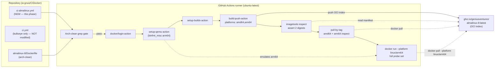

# Phase 4: Multi-arch Verification - Research

**Researched:** 2026-09-09
**Domain:** Docker multi-arch image verification (GitHub Actions + buildx + QEMU + ghcr.io)
**Confidence:** HIGH

<user_constraints>
## User Constraints (from CONTEXT.md)

### Locked Decisions

- **D-01:** ghcr repository name = `ghcr.io/geniusventures/almalinux-8` — mirrors the `debian-bullseye` convention and the repo dir name.
- **D-02:** Tag = `:latest` only. No versioned alias (`:8`, `:8.10`).
- **D-03:** A **separate workflow file** (e.g. `.github/workflows/ci-almalinux.yml`), NOT a second matrix entry in `ci.yml`. `ci.yml` stays bullseye-only and is not modified.
- **D-04:** The new workflow builds and pushes `ghcr.io/geniusventures/almalinux-8:latest` with `platforms: linux/amd64,linux/arm64` via buildx, mirroring `ci.yml`'s steps (login, `setup-qemu-action` with `platforms: arm64`, `setup-buildx-action`, `build-push-action`). It coexists with the bullseye job during the grace period — both images keep pushing.
- **D-05:** The arm64 run-smoke is an **in-CI QEMU step** in the new workflow: after push, `docker run --platform linux/arm64 ghcr.io/geniusventures/almalinux-8:latest …` runs the tool probes under QEMU. No manual repo script.
- **D-06:** The smoke covers the **full tool probe set** on arm64 — rustc/node/java/mold/clang/cmake/gh/pkg-config plus vulkan/gtk/libsecret probes — matching success criterion 3's "every tool" (and specifically resolving the STACK.md MEDIUM-confidence aarch64 items `gnome-keyring`, `vulkan-headers`, `gh`).
- **D-07:** A **grep assertion in CI** fails the build if `armhf`/`i386` appear in `almalinux-8/Dockerfile`. The invariant is already satisfied (Phase 2 D-05/D-10 deleted those branches; mold/rust/JDK blocks have 2-arm maps with a hard `exit 1` default) — this gate protects it going forward.

### Claude's Discretion

- New workflow filename (`ci-almalinux.yml` suggested), the exact smoke probe command list, and the exact grep expression for the arch-clean gate are at Claude's discretion — use the simplest approach consistent with the decisions above. No manual repo script is needed (user chose in-CI only).

### Deferred Ideas (OUT OF SCOPE)

- **Remove `debian-bullseye`** (LIFE-01) — after the Alma image is validated in CI; the separate workflow makes this a clean deletion.
</user_constraints>

<phase_requirements>
## Phase Requirements

| ID | Description | Research Support |
|----|-------------|------------------|
| BASE-03 | Image builds for `amd64` and `arm64` only (no `armhf`/`i386`) | Buildx `platforms: linux/amd64,linux/arm64` (§Standard Stack, §Code Examples); arch-clean grep gate with token-based regex (`(armhf|i386)\)` + `armv7-unknown`/`i686-unknown`) plus positive `exit 1` ≥ 3 assertion (§Common Pitfalls Pitfall 1, §Code Examples). |
| PAR-03 | Multi-arch build verified with `docker buildx --platform linux/amd64,linux/arm64` | `build-push-action` multi-platform push produces one OCI index manifest list; `docker buildx imagetools inspect` asserts both platform digests (§Architecture Patterns, §Code Examples). Arm64 runtime smoke + pull-by-tag resolution complete the verification. |
</phase_requirements>

## Summary

Phase 4 is a **verification + CI-wiring phase**, not a Dockerfile phase. The `almalinux-8/Dockerfile` is already arch-clean (Phase 2 D-05/D-10 deleted the `armhf`/`i386` branches; mold/Rust/JDK blocks each map `x86_64`/`aarch64` with a hard `exit 1` default). What is missing is the **automated proof** that the image builds and runs on exactly `amd64` + `arm64`, and that CI consumers can pull the correct architecture by tag.

The entire deliverable is **one new file**, `.github/workflows/ci-almalinux.yml`, which mirrors `ci.yml`'s login/QEMU/buildx/build-push steps verbatim and then adds three verification steps: (1) a static arch-clean grep gate, (2) a multi-arch manifest inspection that asserts both `linux/amd64` and `linux/arm64` digests exist in a single manifest list, and (3) a QEMU-emulated arm64 `docker run` smoke test covering the full tool probe set, plus pull-by-tag architecture resolution checks.

**Primary recommendation:** Mirror `ci.yml`'s five steps verbatim into `ci-almalinux.yml`, then append three inline `run:` steps — an arch-clean grep gate (using the case-label token `(armhf|i386)\)`, *not* a bare `armhf|i386` grep), a `docker buildx imagetools inspect --raw` assertion for both platforms, and a `docker run --platform linux/arm64` full-probe smoke that asserts `uname -m` = `aarch64`. No new Dockerfile layers, no repo scripts.

## Architectural Responsibility Map

This is a CI/CD-infrastructure phase, so tiers map to CI/CD components rather than app tiers.

| Capability | Primary Tier | Secondary Tier | Rationale |
|------------|-------------|----------------|-----------|
| Multi-arch image build | GitHub Actions runner (`ubuntu-latest`) | BuildKit builder (docker-container driver via buildx) | `build-push-action` drives buildx; arm64 emulation is provided by QEMU `binfmt_misc` (D-05). |
| Manifest-list creation + push | BuildKit (buildx) | ghcr.io (registry) | `platforms: linux/amd64,linux/arm64` + `push: true` produces one OCI index pushed to the registry. |
| Manifest verification (both digests) | GitHub Actions runner | ghcr.io (registry API) | `docker buildx imagetools inspect` queries the registry; no build required. |
| arm64 runtime smoke test | GitHub Actions runner + QEMU emulation | — | `binfmt_misc` emulates arm64 for `docker run --platform linux/arm64` (D-05/D-06). |
| Arch-clean static gate (BASE-03) | GitHub Actions runner | — | Pure `grep` on the source file; no runtime. |
| Pull-by-tag architecture resolution | GitHub Actions runner (`docker pull`/`inspect`) | ghcr.io | Docker resolves the correct platform variant from the manifest list. |

## Project Constraints (from copilot-instructions.md)

Directives extracted from `.github/copilot-instructions.md` that the planner must honor:

- **glibc ≤ 2.31** for binary compatibility — satisfied by AlmaLinux 8's glibc 2.28. Nothing in Phase 4 changes this.
- **`amd64` + `arm64` only** — RHEL clones ship no 32-bit ARM/x86. This is exactly BASE-03 / success criterion 2; the arch-clean gate enforces it.
- **Toolchain parity** — the new image must reproduce the bullseye toolchain. Phase 4 verifies the image, it does not add toolchain layers.
- **Keep `debian-bullseye` alongside during the grace period** — the separate workflow (D-03) exists precisely so both images keep pushing in parallel until LIFE-01.
- **`.github/workflows/ci.yml` is the CI source of truth to mirror — do NOT modify it** (Phase 4 D-03, echoed in the mode instructions' `files_to_read`).
- **GSD workflow enforcement** — no direct repo edits outside a GSD workflow; Phase 4's only artifact is created within the GSD execute phase.

No project `CLAUDE.md`, `.claude/skills/`, or `.agents/skills/` exist (verified by search) — no additional project-skill patterns apply.

## Standard Stack

### Core (GitHub Actions — all already the in-repo convention)

| Component | Version | Purpose | Why Standard |
|-----------|---------|---------|--------------|
| `docker/build-push-action` | `v7` (latest v7.3.0) | Multi-platform build + push | `platforms` CSV input produces a single OCI index; `push: true` is a shorthand for registry output. Already used in `ci.yml`. |
| `docker/setup-qemu-action` | `v4` (latest v4.3.0) | Register QEMU `binfmt_misc` for arm64 | Required for both the arm64 build and the `docker run --platform linux/arm64` smoke (D-05). |
| `docker/setup-buildx-action` | `v4` | Create buildx builder (docker-container driver) | The docker-container driver is required for multi-platform builds. |
| `docker/login-action` | `v4` | Authenticate to ghcr.io | Logs in as `github.actor` with `GITHUB_TOKEN`; needed for push, pull, and `imagetools inspect`. |
| `actions/checkout` | `v6` | Check out repo (path context for buildx) | Required because the build uses a `context:` path, not Git context. |
| `docker buildx` (CLI) | runner preinstalled | `imagetools inspect` | Verifies the pushed manifest list (PAR-03). No separate install needed on `ubuntu-latest`. |

**Versions are pinned to major tags only (`@v4`, `@v7`) — mirror `ci.yml` verbatim (D-04).** Latest minor releases confirmed current as of research date: `build-push-action@v7.3.0`, `setup-qemu-action@v4.3.0` `[VERIFIED: github.com/docker/* READMEs]`.

### Supporting

| Component | Version | Purpose | When to Use |
|-----------|---------|---------|-------------|
| `grep` (GNU) | — | Arch-clean gate | Native on `ubuntu-latest` runner; do not depend on `jq`. |
| `jq` | preinstalled on ubuntu-latest | Optional JSON manifest parse | Avoid — `grep` on `imagetools inspect --raw` is sufficient and removes the dependency. |

### Alternatives Considered

| Instead of | Could Use | Tradeoff |
|------------|-----------|----------|
| `docker buildx imagetools inspect --raw` | `docker manifest inspect` | `docker manifest` is deprecated (warns since Docker 23+); `imagetools inspect` is the current standard. |
| grep on `--raw` JSON | `jq` on `--raw` JSON | `jq` is preinstalled but `grep '"architecture":"amd64"'` is simpler and has no whitespace ambiguity. |
| Inline `run:` steps | Separate composite action / shell script | D-05 explicitly chose in-CI steps, no repo script; inline steps keep the surface to one file. |
| `paths:` trigger filter on the workflow | Plain `on: push` | A paths filter (e.g. `almalinux-8/**`) avoids rebuilding on unrelated changes; plain `push` mirrors `ci.yml`. Either is acceptable at discretion — default to mirroring `ci.yml`. |

**Installation:** No package-manager installs. The only new artifact is `.github/workflows/ci-almalinux.yml`.

## Package Legitimacy Audit

> **N/A** — this phase installs no npm/PyPI/crates packages. The only external dependencies are the official `docker/*` GitHub Actions (already pinned and in use by the working `ci.yml`), the `almalinux:8` base image (already validated in Phases 1–3), and the upstream mold/rustup/Temurin/NodeSource tarballs (unchanged from prior phases). The `docker/*` actions were verified against their official GitHub repositories (`docker/build-push-action`, `docker/setup-qemu-action`) `[VERIFIED: github.com/docker/*]`. No slopcheck gate applies.

## Architecture Patterns

### System Architecture Diagram



**Flow:** checkout → arch-clean gate → login → QEMU → buildx → build+push (creates the OCI index in ghcr.io) → `imagetools inspect` asserts both platform digests → `docker pull` verifies each platform resolves to the right architecture → QEMU-emulated arm64 smoke runs the full probe set.

### Recommended Project Structure

```
.github/workflows/
├── ci.yml                # bullseye-only (UNCHANGED — source of truth)
└── ci-almalinux.yml      # NEW: Alma multi-arch build + verify (this phase's only artifact)
```

No changes to `almalinux-8/` or `debian-bullseye/`.

### Pattern 1: Multi-platform push via build-push-action

**What:** One build-push step with a `platforms` CSV produces a single OCI index (manifest list) and pushes it to the registry. BuildKit + QEMU emulation handle the non-native arm64 build on the amd64 runner.

**When to use:** Whenever an image must be published for multiple architectures in one reference.

**Example:**
```yaml
- name: Build and push
  uses: docker/build-push-action@v7
  with:
    context: almalinux-8
    platforms: linux/amd64, linux/arm64
    push: true
    tags: ghcr.io/geniusventures/almalinux-8:latest
```
`[VERIFIED: github.com/docker/build-push-action — "platforms" and "push" inputs; "Multi-platform image" example]`

### Pattern 2: Manifest verification via imagetools inspect

**What:** `docker buildx imagetools inspect --raw` prints the raw OCI index JSON; asserting both `"architecture":"amd64"` and `"architecture":"arm64"` proves success criterion 1 (a single manifest with both digests) without jq.

**When to use:** As the PAR-03 verification step immediately after push.

**Example:**
```bash
docker buildx imagetools inspect --raw ghcr.io/geniusventures/almalinux-8:latest > /tmp/manifest.json
grep -q '"architecture":"amd64"' /tmp/manifest.json
grep -q '"architecture":"arm64"'  /tmp/manifest.json
```
`[VERIFIED: docs.docker.com/reference/cli/docker/buildx/imagetools/inspect/ — "--raw" JSON shows manifests[].platform.architecture]`

### Pattern 3: QEMU-emulated arm64 run smoke

**What:** After `setup-qemu-action` registers `binfmt_misc`, `docker run --platform linux/arm64` executes an arm64 container on the amd64 runner. Asserting `uname -m` = `aarch64` proves the run is genuinely arm64, then the in-image probe strings (reused verbatim from the Dockerfile's step-10 verification chain) assert every tool works.

**When to use:** The D-05/D-06 arm64 runtime sign-off.

**Example:**
```yaml
- name: arm64 run smoke test
  run: |
    docker run --rm --platform linux/arm64 ghcr.io/geniusventures/almalinux-8:latest bash -ec '
      set -eux
      test "$(uname -m)" = aarch64
      rustc --version | grep -q 1.87.0
      node --version | grep -qE "^v24\."
      node -e "process.exit(0)"
      java -version 2>&1 | grep -q Temurin-25
      ld --version | grep -q "mold 2.42.0"
      clang --version | head -1
      cmake --version | head -1
      gh --version
      pkg-config --version
      pkg-config --exists vulkan
      pkg-config --exists gtk+-3.0
      pkg-config --exists libsecret-1
      rpm -q gnome-keyring vulkan-headers
    '
```
`[VERIFIED: github.com/docker/setup-qemu-action — README example "docker run --rm --platform linux/arm64 alpine uname -m" prints aarch64]`

### Anti-Patterns to Avoid

- **`load: true` with multi-`platforms`:** `load` exports a single image to the local Docker daemon and conflicts with multi-platform; it must not be set alongside `platforms: linux/amd64,linux/arm64`.
- **Bare `grep -E 'armhf|i386'`:** matches the two existing prose comments ("the armhf/i386 branches are deleted") and falsely fails the gate — see Pitfall 1.
- **Smoke-testing a locally built single-arch image instead of the pushed tag:** success criterion 4 is about pull-by-tag resolution — the smoke must `docker pull`/run the pushed `ghcr.io/.../almalinux-8:latest` reference, not a local build.
- **Putting QEMU after buildx:** `setup-qemu-action` must run before `setup-buildx-action` (and before any `docker run --platform linux/arm64`), matching `ci.yml`'s order.
- **Forgetting the workflow-level `packages: write` permission:** without it, the push to ghcr.io fails; `ci.yml` already carries `permissions: { contents: read, packages: write }` — mirror it.

## Don't Hand-Roll

| Problem | Don't Build | Use Instead | Why |
|---------|-------------|-------------|-----|
| Multi-arch manifest assembly | A script that builds each arch separately then `docker manifest create/annotate/push` | `docker/build-push-action@v7` with `platforms: linux/amd64,linux/arm64` | buildx creates and pushes the OCI index atomically; hand-rolled manifest merges are a classic source of wrong-digest bugs. |
| Cross-arch emulation | Manually installing `qemu-user-static` + writing binfmt rules | `docker/setup-qemu-action@v4` with `platforms: arm64` | Registers `binfmt_misc` correctly on the runner and uninstalls stale emulators. |
| Registry authentication | Hand-written `docker login` with `echo`ed secrets | `docker/login-action@v4` | Avoids secret leakage into logs and handles credential storage correctly. |
| Manifest inspection | Parsing `docker manifest inspect` deprecated output | `docker buildx imagetools inspect --raw` | Current, stable, JSON-shaped output; `docker manifest` is deprecated. |
| Arch-clean checking | A bespoke lint script | A single `grep` step in CI | The invariant is a simple substring/pattern test; a script is over-engineering (D-07). |

**Key insight:** The entire phase collapses to one workflow file because GitHub's `docker/*` action ecosystem + buildx already solves multi-arch build, emulation, auth, and manifest inspection. Anything hand-rolled here would be more fragile than the standard stack.

## Common Pitfalls

### Pitfall 1: The arch-clean grep matches its own documentation comments
**What goes wrong:** A naive `grep -E 'armhf|i386' almalinux-8/Dockerfile` matches lines 143 and 165 — the comments "the armhf/i386 branches are deleted" — and fails the gate even though the file is correct.
**Why it happens:** The comments that *describe* the deletion literally contain the tokens `armhf` and `i386`.
**How to avoid:** Use the case-label token form (with closing paren) plus the concrete Rust triples: `grep -nE '(armhf|i386)\)|armv7-unknown|i686-unknown' almalinux-8/Dockerfile`. Verified against the current file: this returns **zero** matches, while the naive grep returns 2. Optionally strengthen with a positive assertion that all three blocks still have hard `exit 1` defaults: `test "$(grep -cE 'exit 1' almalinux-8/Dockerfile)" -ge 3` (verified count = 3).
**Warning signs:** A green workflow suddenly failing the gate after a doc/comment edit.

### Pitfall 2: `docker run --platform linux/arm64` fails with "exec format error"
**What goes wrong:** The smoke step errors before the probe output appears.
**Why it happens:** QEMU binfmt handlers were not registered — typically because `setup-qemu-action` was omitted or ordered after the run step.
**How to avoid:** Place `setup-qemu-action@v4` (with `platforms: arm64`) before `setup-buildx-action` and before any `docker run --platform linux/arm64`; mirror `ci.yml`'s ordering exactly.
**Warning signs:** The build-push step succeeds (buildx has its own QEMU handling) but the `docker run` step fails — classic misordering.

### Pitfall 3: Verifying only one architecture, or relying on `docker pull` alone
**What goes wrong:** The phase "passes" without proof that a single manifest list carries both digests.
**Why it happens:** Pulling with `--platform` exercises resolution, but doesn't show the registry manifest list. A single-arch push (e.g. forgetting `platforms` in build-push) can still produce a pullable image.
**How to avoid:** Add the `imagetools inspect --raw` step asserting **both** `"architecture":"amd64"` and `"architecture":"arm64"` before the pull/smoke steps.
**Warning signs:** Only one `grep -q` for a single platform; no manifest-inspect step.

### Pitfall 4: The pull-by-tag resolution check overwrites the local tag
**What goes wrong:** After `docker pull <tag>` (amd64) then `docker pull --platform linux/arm64 <tag>`, the local tag now points at arm64 — an `inspect` placed after both pulls would report arm64 twice.
**Why it happens:** A single local reference can only hold one image; the second pull replaces the first.
**How to avoid:** Inspect immediately after each pull, or use distinct checks: pull amd64 → `inspect` → expect `amd64`; pull `--platform linux/arm64` → `inspect` → expect `arm64`.
**Warning signs:** An `inspect` step that runs after both pulls and asserts both arches from the same reference.

### Pitfall 5: Secret/env-var over-carry from ci.yml
**What goes wrong:** Blindly copying `ci.yml`'s workflow-level `env: GH_TOKEN: ${{ secrets.GNUS_TOKEN_1 }}` when the Alma build doesn't need it.
**Why it happens:** `ci.yml` sets `GH_TOKEN` but no step in it consumes that env var; the Alma Dockerfile's `gh --version` probe needs no token.
**How to avoid:** Omit the `GH_TOKEN` env from the new workflow (simplest). It is harmless to include for symmetry, but it is not required — no step or Dockerfile instruction makes a `gh` API call.
**Warning signs:** None at runtime; this is a hygiene point, not a correctness one.

### Pitfall 6: Context mismatch in build-push-action
**What goes wrong:** Build fails because the Dockerfile is not found, or the wrong context is shipped.
**Why it happens:** `build-push-action` defaults `file` to `{context}/Dockerfile`.
**How to avoid:** Set `context: almalinux-8` (mirroring `context: debian-bullseye` in `ci.yml`), which resolves to `almalinux-8/Dockerfile`. Note the Dockerfile has no `COPY` of `fixture/`, so the `almalinux-8` subdirectory context is sufficient (the `fixture/` and `verify-parity.sh` in that dir ride along unused — harmless; a `.dockerignore` is an optional tidy-up, not required).
**Warning signs:** "unable to prepare context" or a missing-Dockerfile error.

## Code Examples

Verified patterns from official sources (see Sources).

### The complete workflow (recommended)

```yaml
name: ci-almalinux

permissions:
  contents: read
  packages: write

on:
  push:
  workflow_dispatch:

jobs:
  docker:
    runs-on: ubuntu-latest
    steps:
      - name: Checkout
        uses: actions/checkout@v6

      - name: Arch-clean gate (BASE-03)
        run: |
          if grep -nE '(armhf|i386)\)|armv7-unknown|i686-unknown' almalinux-8/Dockerfile; then
            echo "::error::32-bit architecture reference found in almalinux-8/Dockerfile"
            exit 1
          fi
          test "$(grep -cE 'exit 1' almalinux-8/Dockerfile)" -ge 3

      - name: Login to ghcr.io
        uses: docker/login-action@v4
        with:
          registry: ghcr.io
          username: ${{github.actor}}
          password: ${{secrets.GITHUB_TOKEN}}

      - name: Set up QEMU
        uses: docker/setup-qemu-action@v4
        with:
          platforms: arm64

      - name: Set up Docker Buildx
        uses: docker/setup-buildx-action@v4

      - name: Build and push (multi-arch)
        uses: docker/build-push-action@v7
        with:
          context: almalinux-8
          platforms: linux/amd64, linux/arm64
          push: true
          tags: ghcr.io/geniusventures/almalinux-8:latest

      - name: Verify multi-arch manifest (PAR-03)
        run: |
          docker buildx imagetools inspect --raw ghcr.io/geniusventures/almalinux-8:latest > /tmp/manifest.json
          grep -q '"architecture":"amd64"' /tmp/manifest.json
          grep -q '"architecture":"arm64"'  /tmp/manifest.json

      - name: Pull-by-tag resolution (amd64 + arm64)
        run: |
          docker pull ghcr.io/geniusventures/almalinux-8:latest
          test "$(docker inspect --format '{{.Architecture}}' ghcr.io/geniusventures/almalinux-8:latest)" = amd64
          docker pull --platform linux/arm64 ghcr.io/geniusventures/almalinux-8:latest
          test "$(docker inspect --format '{{.Architecture}}' ghcr.io/geniusventures/almalinux-8:latest)" = arm64

      - name: arm64 run smoke test (full probe set)
        run: |
          docker run --rm --platform linux/arm64 ghcr.io/geniusventures/almalinux-8:latest bash -ec '
            set -eux
            test "$(uname -m)" = aarch64
            rustc --version | grep -q 1.87.0
            node --version | grep -qE "^v24\."
            node -e "process.exit(0)"
            java -version 2>&1 | grep -q Temurin-25
            ld --version | grep -q "mold 2.42.0"
            clang --version | head -1
            cmake --version | head -1
            gh --version
            pkg-config --version
            pkg-config --exists vulkan
            pkg-config --exists gtk+-3.0
            pkg-config --exists libsecret-1
            rpm -q gnome-keyring vulkan-headers
          '
```

The smoke's probe strings (`rustc … 1.87.0`, `node … ^v24\.`, `java … Temurin-25`, `ld … mold 2.42.0`) are reused **verbatim** from the Dockerfile's step-10 in-image verification chain, so the post-push smoke is a runtime re-check of the exact gates already exercised at build time `[VERIFIED: almalinux-8/Dockerfile steps 9–10]`.

### Manifest inspect (alternative, human-readable)

```bash
docker buildx imagetools inspect ghcr.io/geniusventures/almalinux-8:latest | tee /tmp/manifest.txt
grep -qE 'Platform:[[:space:]]+linux/amd64' /tmp/manifest.txt
grep -qE 'Platform:[[:space:]]+linux/arm64'  /tmp/manifest.txt
```
`[VERIFIED: docs.docker.com/reference/cli/docker/buildx/imagetools/inspect/ — pretty output shows "Platform: linux/amd64" / "Platform: linux/arm64" entries]`

## State of the Art

| Old Approach | Current Approach | When Changed | Impact |
|--------------|------------------|--------------|--------|
| Per-arch `docker build` + `docker manifest create/annotate/push` | `docker buildx build --platform a,b --push` (via `build-push-action`) | buildx GA (Docker 19.03+/20.10) | Single-step atomic OCI index creation; no manual digest stitching. |
| `docker manifest inspect` | `docker buildx imagetools inspect` | Docker 23+ (manifest command deprecated) | Stable JSON + `--raw` output; the deprecated command is retained but discouraged. |
| `tonistiigi/binfmt` manual install | `docker/setup-qemu-action` | GitHub Actions `docker/*` action suite | Declarative, cache-aware emulator registration on hosted runners. |

**Deprecated/outdated:**
- `docker manifest inspect` — deprecated; use `docker buildx imagetools inspect`.
- Manual binfmt registration — superseded by `setup-qemu-action`.

## Assumptions Log

| # | Claim | Section | Risk if Wrong |
|---|-------|---------|---------------|
| A1 | `GH_TOKEN` (`secrets.GNUS_TOKEN_1`) is not required by the Alma workflow because neither the workflow nor the Dockerfile makes `gh` API calls | Code Examples / Pitfall 5 | None at build time; worst case a future step that needs `gh` auth would fail — revisit only if such a step is added. |
| A2 | QEMU is not registered on the local Windows Docker Desktop, so a local `--platform linux/arm64` build/run is unavailable; arm64 verification is CI-only by design (D-05) | Environment Availability | If local arm64 pre-flight were ever wanted, extra QEMU setup would be required — not part of this phase. |
| A3 | `ubuntu-latest` preinstalls `docker` + `buildx`, so `docker buildx imagetools inspect` works without an extra install step | Standard Stack | Very low — `setup-buildx-action` also guarantees buildx; if absent, `docker manifest inspect` is the fallback. |
| A4 | The smoke probe set completes comfortably within GitHub Actions default job timeout under QEMU emulation | Code Examples | Low — `--version` probes are milliseconds each; `java -version` is the slowest and still fast. |
| A5 | The pushed ghcr.io image is readable by the same job's `docker pull`/`inspect` because `docker/login-action` authenticated earlier in the job | Architecture Patterns | Low — standard behavior; if the package is private, the job's own login still covers reads within the same run. |

## Open Questions

1. **Should the new workflow use a `paths:` trigger filter?**
   - What we know: D-03 mandates a separate workflow; `ci.yml` triggers on plain `push` + `workflow_dispatch`.
   - What's unclear: whether to rebuild the Alma image on every push (including bullseye-only or docs changes).
   - Recommendation: Default to mirroring `ci.yml` (`push` + `workflow_dispatch`) for simplicity; a `paths: [almalinux-8/**, .github/workflows/ci-almalinux.yml]` filter is an acceptable optional optimization at planner's discretion — flag for user only if the rebuild-on-every-push cost matters.

2. **Does the consuming CI already point at a `:latest` tag or a digest?**
   - What we know: D-02 pins `:latest` only; bullseye is already consumed as `ghcr.io/geniusventures/debian-bullseye:latest`.
   - What's unclear: whether any downstream pipeline references the new image name yet (final thirdparty-CI verification is explicitly deferred out of this phase).
   - Recommendation: Nothing to do in this phase beyond pushing `:latest`; the downstream pointer change is the deferred "final verification".

## Environment Availability

The phase executes in **GitHub Actions CI** (`ubuntu-latest`). Local (Windows) availability is relevant only for an optional pre-flight of the grep gate.

| Dependency | Required By | Available (CI) | Version | Fallback |
|------------|------------|----------------|---------|----------|
| `docker` | build/pull/run/inspect | ✓ ubuntu-latest preinstalled | runner-current | — |
| `docker buildx` | multi-arch build + `imagetools inspect` | ✓ ubuntu-latest preinstalled + `setup-buildx-action@v4` | runner-current | `docker manifest inspect` (deprecated) |
| QEMU (binfmt_misc) | arm64 build + run smoke | ✓ via `setup-qemu-action@v4` | v4.3.0 | — |
| `grep`/`sed` (GNU) | arch-clean gate | ✓ ubuntu-latest native | — | — |
| `jq` | optional JSON parse | ✓ ubuntu-latest preinstalled | — | use `grep` on `--raw` JSON (chosen) |
| ghcr.io `packages: write` | push | ✓ (already used by `ci.yml`) | — | — |
| Local `docker` (Windows) | optional pre-flight | — | ✓ 28.0.4 (daemon running) | — |
| Local `buildx` (Windows) | optional pre-flight | — | ✓ v0.22.0 | — |
| Local QEMU (Windows) | optional arm64 pre-flight | — | ✗ (not registered — A2) | CI-only per D-05 |
| Local `grep`/`sed` (Windows) | optional gate pre-flight | — | ✗ in PowerShell; ✓ via Git Bash (`bash` on PATH) | run as `bash -c '…'` |

**Missing dependencies with no fallback:** none — CI (`ubuntu-latest`) provides everything; `setup-qemu-action` supplies QEMU.

**Missing dependencies with fallback:**
- Local QEMU → arm64 verification is CI-only by design (D-05), no local fallback needed.
- Local `grep`/`sed` in PowerShell → use Git Bash (`bash` is on PATH) for a local pre-flight of the gate.

## Security Domain

> `security_enforcement` is enabled (ASVS level 1, block-on-high). This is a CI/Docker-infrastructure phase with no application attack surface (no auth, session, access-control, or crypto features). Honest assessment follows.

### Applicable ASVS Categories

| ASVS Category | Applies | Standard Control |
|---------------|---------|-----------------|
| V2 Authentication | no | Registry auth delegated to `docker/login-action` with ephemeral `GITHUB_TOKEN`. |
| V3 Session Management | no | N/A (stateless CI job). |
| V4 Access Control | no | Repository-scoped `permissions: { contents: read, packages: write }` — least privilege at the workflow level. |
| V5 Input Validation | no | No user-supplied input reaches this workflow; the grep gate and probes use fixed string literals. |
| V6 Cryptography | no | No crypto hand-rolled; integrity of toolchain tarballs (rustup SHA256-pinned, mold/Temurin over TLS) was already established in Phase 2 and is unchanged. |

### Known Threat Patterns for CI/Docker workflow

| Pattern | STRIDE | Standard Mitigation |
|---------|--------|---------------------|
| Secret leakage into build logs | Information Disclosure | `docker/login-action` handles credentials; no step `echo`s `GITHUB_TOKEN` or `GNUS_TOKEN_1`; smoke output is tool version strings only. |
| Malicious/untrusted base image | Tampering / Spoofing | Build from official `almalinux:8` (already validated); build context from `actions/checkout@v6` of the repo's own pinned commit. |
| Supply-chain substitution in actions | Tampering | Pin to official `docker/*` actions (`@v4`/`@v7`), the same set already trusted and running in `ci.yml`. |
| Workflow injection via dynamic content | Tampering | No dynamic data is interpolated into shell — all grep/run commands use literal strings. |
| Over-broad GITHUB_TOKEN scope | Elevation of Privilege | `permissions` block scoped to `contents: read` + `packages: write` (mirrors `ci.yml`). |

## Sources

### Primary (HIGH confidence)
- `docs.docker.com/reference/cli/docker/buildx/imagetools/inspect/` — `--raw` JSON shape, `Platform:`/`"architecture"` output for multi-platform manifests (verified).
- `github.com/docker/build-push-action` (README + releases) — `platforms` and `push` inputs; latest v7.3.0; "Multi-platform image" example (verified).
- `github.com/docker/setup-qemu-action` (README + releases) — `platforms` input; registers QEMU with `binfmt_misc`; `docker run --platform linux/arm64 alpine uname -m` → `aarch64`; latest v4.3.0; must precede setup-buildx (verified).
- `.github/workflows/ci.yml` (in-repo) — authoritative step sequence (checkout@v6, login-action@v4, setup-qemu-action@v4 `platforms: arm64`, setup-buildx-action@v4, build-push-action@v7) and `permissions` block to mirror (verified).
- `almalinux-8/Dockerfile` (in-repo) — step-9/10 probe strings reused in the smoke; confirmed arch-clean: `grep -nE '(armhf|i386)\)|armv7-unknown|i686-unknown'` → 0 matches; `grep -cE 'exit 1'` → 3; `x86_64)`/`aarch64)` labels present in all 3 blocks (verified by live grep audit).

### Secondary (MEDIUM confidence)
- `github.com/docker/setup-buildx-action` and `github.com/docker/login-action` — inputs inferred from the `ci.yml` usage (not fetched individually; behavior confirmed by the working bullseye pipeline).

### Tertiary (LOW confidence)
- None. Every gate and command in this research was either verified against official Docker docs, the official action READMEs, or the live repo files.

## Metadata

**Confidence breakdown:**
- Standard stack: HIGH — action versions and inputs verified against official action repos + the working `ci.yml`.
- Architecture: HIGH — the CI-flow shape mirrors the proven bullseye workflow; `imagetools inspect` and QEMU smoke verified against official docs.
- Pitfalls: HIGH — Pitfall 1 (grep false-positive) and Pitfall 3/4 (inspect/pull ordering) were verified against the live Dockerfile and official output formats.

**Research date:** 2026-09-09
**Valid until:** 2026-10-09 (stable domain — GitHub Actions major versions and Docker CLI behavior change slowly)
